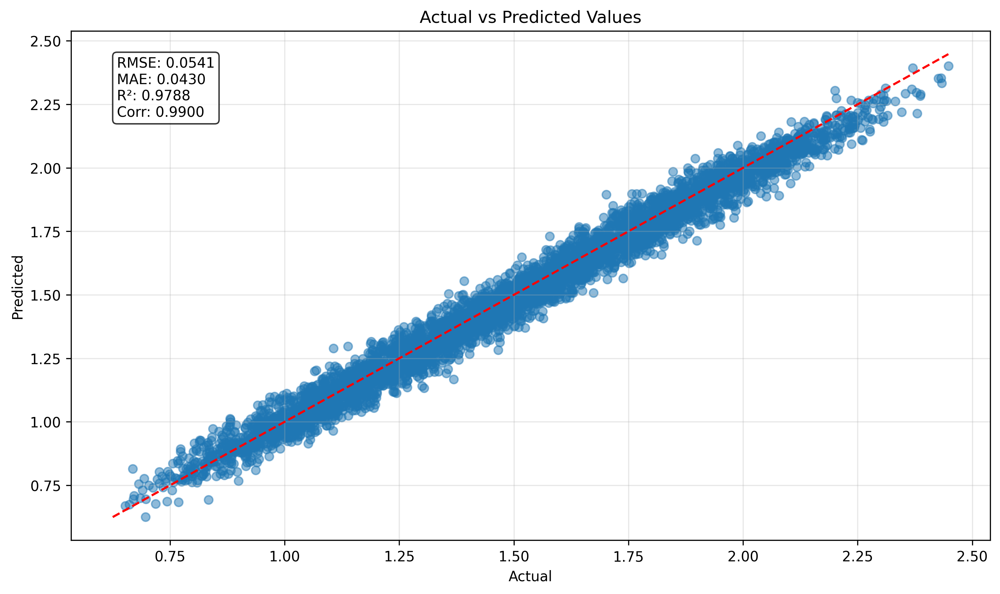
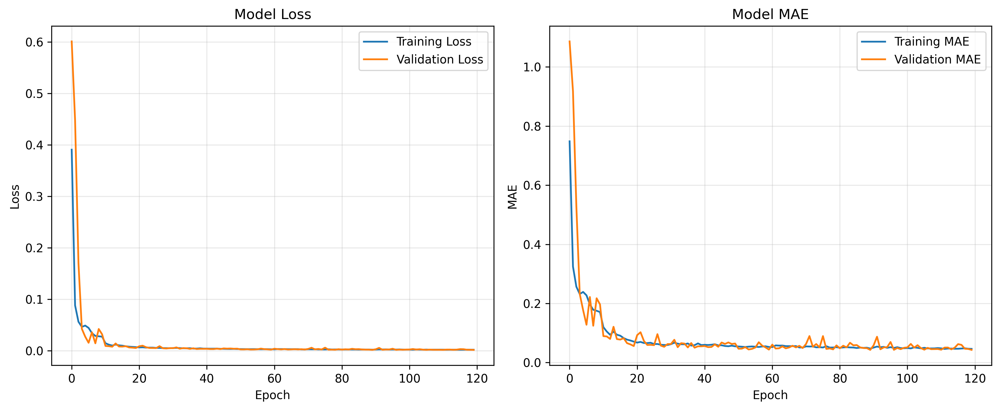

# Solar Forecaster LSTM

A sophisticated machine learning system that uses Long Short-Term Memory (LSTM) neural networks to forecast solar activity and space weather conditions. This system analyzes historical solar data (GOES X-ray flux) and solar wind parameters (from ACE satellite) to predict future solar conditions, which is critical for power grid stability and satellite operations.



## Features

- **Multi-horizon Forecasting**: Predicts solar conditions up to 12 time steps into the future
- **Transfer Learning**: Leverages pre-trained models to improve prediction accuracy
- **Curriculum Learning**: Implements progressive training strategy for complex patterns
- **Data Augmentation**: Uses sophisticated time series augmentation techniques
- **Physics-guided Models**: Incorporates domain knowledge into the neural network architecture

## Project Structure

```
├── data/               # Data directory
│   ├── raw/            # Raw data
│   ├── interim/        # Intermediate processed data
│   └── processed/      # Fully processed data
├── logs/               # Training logs
├── models/             # Trained models
├── notebooks/          # Jupyter notebooks
├── reports/            # Reports and figures
│   └── figures/        # Generated graphics and figures
├── src/                # Source code
│   ├── data/           # Data processing scripts
│   ├── features/       # Feature engineering scripts
│   ├── models/         # Model definitions
│   ├── utils/          # Utility functions
│   └── visualization/  # Visualization scripts
└── tests/              # Test files
```

## Installation

```bash
# Clone the repository
git clone https://github.com/yourusername/solar-forecaster-lstm.git
cd solar-forecaster-lstm

# Create and activate a virtual environment (optional)
python -m venv venv
source venv/bin/activate  # On Windows: venv\Scripts\activate

# Install dependencies
pip install -r requirements.txt
```

## Usage

### Data Preparation

```bash
python src/data/download.py --start_date 2020-01-01 --end_date 2020-01-31
python src/data/preprocess.py
```

### Training

```bash
python main.py
```

### Evaluation

The evaluation results will be saved in the `reports/figures/` directory, including:
- Training history plots
- Actual vs predicted visualizations
- Error distribution analysis
- Performance metrics

## Results

The model achieves strong performance in forecasting solar activity:

- RMSE: [Your RMSE value]
- MAE: [Your MAE value]
- R²: [Your R² value]
- Correlation: [Your correlation value]




## License

This project is licensed under the MIT License - see the [LICENSE](LICENSE) file for details.

## Acknowledgments

- [List any data sources, papers, or other resources that inspired or helped your project]